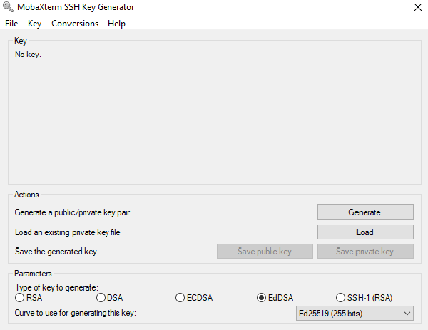
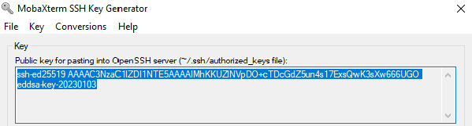

[Sommaire](../SOMMAIRE.md) › [Accueil](../index.md) › [Ressources de calcul](../ressources.md) › Se connecter aux ressources et gestion des clés ssh

# Se connecter aux ressources et gestion des clés ssh

## Qu'est-ce qu'une clé SSH ?[​](#quest-ce-quune-clé-ssh- "Lien direct vers Qu'est-ce qu'une clé SSH ?")

Une clé ssh est un ensemble de deux fichiers, permettant d'établir des clés de chiffrement. Ces deux fichiers constituent:

- La clé privée: **ce fichier ne doit être partagé avec personne, il est strictement privé**
- La clé publique: Ce fichier peut être publiquement distribué à qui vous voulez

`ssh` va chiffrer la communication en utilisant votre clé privée, le supercalculateur va le déchiffrer en utilisant votre clé publique. S'il arrive à la déchiffrer on peut être sûr que c'est vous qui êtes connecté-e, puisque vous seul-e possédez la clé privée ! Il est donc possible de vous authentifier grâce à ce système de paires de clés publiques/privées.

En conséquence, la clé privée doit être protégée le mieux possible, et en particulier vous devrez la protéger par un mot de passe (en fait une "passphrase"), afin que si vous vous la faites voler elle ne soit pas utilisable par quelqu'un d'autre que vous.

## Générer sa clé SSH[​](#générer-sa-clé-ssh "Lien direct vers Générer sa clé SSH")

A suivre si vous ne possèdez pas déjà une clé sur votre ordinateur. Sinon vous pouvez passer directement à l'étape 'Déposer sa clé ssh sur les ressources' en étant muni de votre clé publique.


- Windows
- Linux
- Mac

### Windows[​](#windows "Lien direct vers Windows")

#### En ligne de commande (Méthode recommandée)[​](#en-ligne-de-commande-méthode-recommandée "Lien direct vers En ligne de commande (Méthode recommandée)")

Sur un Windows récent (10 ou 11), vous pouvez utiliser directement un terminal Windows (ou PowerShell).

Pour générer votre clé SSH dans le bon format, utilisez la commande suivante :

```bash
ssh-keygen -t ed25519
```

Une fois cette commande lancée, elle va vous poser des questions, laissez tout par défaut sauf la 'passphrase', c'est un mot de passe que vous devez choisir et qui vous sera demandé a chaque connexion utilisant cette clée pour la déverouillée, pour des questions de sécurités nous recommandons fortement de mettre une passphrase.

Cette commande va générer une clé dans un dossier caché nommé '.ssh' situé dans votre dossier utilisateur. Pour y acceder vous pouvez ouvrir une fenetre Windows et indiquer l'emplacement : "*%userprofile%/.ssh*"
Si vous renommez où déplacez cette clé, la connexion ne fonctionnera plus sans une configuration particulière qui ne sera pas expliquez ici.

Une fois la clée crée (fichier id\_ed25519), et sa clé publique associée également (fichier id\_ed25519.pub), le contenu du fichier id\_ed25519.pub contenant la clé publique est ce que vous devez ajouter sur le portail.

#### En utilisant PuttyGen[​](#en-utilisant-puttygen "Lien direct vers En utilisant PuttyGen")

Pour ne pas utiliser une commande via terminal, vous pouvez utiliser une application tel que PuttyGen.

Attention il très important d'utiliser une version à jour de PuttyGen ! Il peut être téléchargé depuis la page officielle de PuTTY (<https://www.chiark.greenend.org.uk/~sgtatham/putty/latest.html>) en allant dans la partie "Alternative Binary Files" et en téléchargeant puttygen.exe.

Dans la fenêtre qui s'affiche, sélectionnez le paramètre EdDSA (Ed25519) :



Puis :

- Cliquez sur 'Generate' et déplacez votre souris dans le cadre jusqu'à ce que la barre verte soit remplie.
  \*Une fois le couple de clés générées vous pouvez modifier le champ 'Key comment' pour mettre un nom plus parlant (Exemple : cle romeo) et ajouter une passphrase pour protéger vos clés (très recommandé).
- Ensuite, vous devez sauver la clé privée en cliquant sur le bouton 'Save private key' et conserver le fichier créé, vous en aurez besoin pour vous connecter à Romeo.
- Enfin vous devez sauver la clé publique, attention il ne faut pas utiliser le bouton 'Save public key' qui donne un format de fichier qui ne sera utile qu'avec des outils comme FileZilla ou WinSCP (voir page de la documenté dédié au transfert de données).

Ce que vous devez récuperer et garder, est la clé publique telle qu'affichée dans l'encadré en haut de la fenêtre.



Vous pourrez ainsi l'ajouter à votre trousseau de clés sur le Portail à l'étape suivante [Déposer sa clé ssh sur les ressources](#Deposer-sa-cle-ssh-sur-les-ressources).

### GNU/Linux[​](#gnulinux "Lien direct vers GNU/Linux")

La commande pour générer une clé SSH :

```text
$ ssh-keygen -t ed25519
Generating public/private ed25519 key pair.
Enter passphrase (empty for no passphrase):
Enter same passphrase again:
Your identification has been saved in .ssh/id_ed25519
Your public key has been saved in .ssh/id_ed25519.pub
The key fingerprint is:
SHA256:wB4qeovtHVtN63JRDrQMvkdHbr2OUdCj3/Rrb52zY40 test@romeo
The key's randomart image is:
+--[ED25519 256]--+
|           .     |
|     .. . o o    |
|     .++ + + .   |
|     o.o= * o .  |
|  . . .oS* o + . |
| . .  .oo.o o . .|
|. . . ..o. +   .=|
| + o +... . . EB+|
|..+ o  o.     oo*|
+----[SHA256]-----+
$ ls -l .ssh
total 8
-rw------- 1 test test 444 déc.  13 12:05 id_ed25519
-rw-r--r-- 1 test test  94 déc.  13 12:05 id_ed25519.pub
```

La commande a permis de créer deux fichiers:

- `id_ed25519` qui contient la clé privée
- `id_ed25519.pub` qui contient la clé publique

Les clés RSA ne sont plus supportés à cause de leur trop faible sécurité.

### Mac OS[​](#mac-os "Lien direct vers Mac OS")

La commande pour générer une clé SSH :

```text
$ ssh-keygen -t ed25519
Generating public/private ed25519 key pair.
Enter passphrase (empty for no passphrase):
Enter same passphrase again:
Your identification has been saved in .ssh/id_ed25519
Your public key has been saved in .ssh/id_ed25519.pub
The key fingerprint is:
SHA256:wB4qeovtHVtN63JRDrQMvkdHbr2OUdCj3/Rrb52zY40 test@romeo
The key's randomart image is:
+--[ED25519 256]--+
|           .     |
|     .. . o o    |
|     .++ + + .   |
|     o.o= * o .  |
|  . . .oS* o + . |
| . .  .oo.o o . .|
|. . . ..o. +   .=|
| + o +... . . EB+|
|..+ o  o.     oo*|
+----[SHA256]-----+
$ ls -l .ssh
total 8
-rw------- 1 test test 444 déc.  13 12:05 id_ed25519
-rw-r--r-- 1 test test  94 déc.  13 12:05 id_ed25519.pub
```

La commande a permis de créer deux fichiers:

- `id_ed25519` qui contient la clé privée
- `id_ed25519.pub` qui contient la clé publique

Les clés RSA ne sont plus supportés à cause de leur trop faible sécurité.

## Déposer sa clé ssh sur les ressources[​](#Deposer-sa-cle-ssh-sur-les-ressources "Lien direct vers Déposer sa clé ssh sur les ressources")

Pour mettre une clé ssh sur la ressource de calcul à laquelle vous souhaitez vous connecter, il faut procéder en deux étapes en ajoutant premièrement la clé publique à votre compte sur le portail, puis en associant la clé à la ressource de calcul.

Attention, l'ajout de votre clé dans le fichier *authorized\_keys* n'est pas autorisé.

### Ajouter une clé à son compte[​](#ajouter-une-clé-à-son-compte "Lien direct vers Ajouter une clé à son compte")

1. Se connecter au [portail Romeo](https://romeo.univ-reims.fr/portal).
2. En haut à droite du site, cliquer sur votre adresse mail, puis sur « My keys » et « New key ».
3. Dans « Label », rentrer un titre pour votre clé.
4. Dans « Key », rentrer votre clé publique. Le format de celle-ci doit être `ssh-<type de la clé> <chaîne de caractères aléatoires représentant votre clé> <éventuel commentaire de votre clé>`. Veillez à ne pas rentrer votre clé privée (qui n'a pas le même format).
5. Cocher « Valid Key » pour que la clé créée soit active.

### Associer une clé à une ressource de calcul[​](#associer-une-clé-à-une-ressource-de-calcul "Lien direct vers Associer une clé à une ressource de calcul")

1. Se connecter au [portail Romeo](https://romeo.univ-reims.fr/portal).
2. Dans le menu principal à gauche, cliquer sur « Dashboard » puis sur « Tous les projets ».
3. Trouver le serveur concerné dans la liste, puis cliquer sur « + gérer mes clés sur cette machine ».
   1. Vous ne verrez ici que les machines associées à des projets dont vous êtes membre. Pensez à vous faire ajouter en tant que membre dans les projets où vous allez calculer sur ROMEO
4. Cocher le bouton de la clé voulue dans la colonne « Active », le bouton se colore alors en vert.
5. Attendre au plus une heure que la clé soit déployée automatiquement.

### Compte valide[​](#compte-valide "Lien direct vers Compte valide")

Pour résumer, pour qu'un compte soit valide et déployé sur ROMEO il faut :

- Un compte crée sur le portail via une première connexion
- Une clé SSH valide ajoutée sur le compte
- Un projet valide dont vous êtes membre
- Une clé SSH valide associée a un projet sur la machine ROMEO et donc vous êtes membre.
- Après que toutes les conditions précédentes ai été remplies, attendre une heure que le déploiement du compte se fasse.
  Si cela ne fonctionne pas, en cas de doute sur ce qui ne va pas pour la création de votre compte, vous pouvez contacter l'équipe ROMEO via le système de tickets.

## Se connecter sur les ressources[​](#se-connecter-sur-les-ressources "Lien direct vers Se connecter sur les ressources")

La connexion aux ressources est détaillée dans une page dédiée pour chaque ressource :

- Romeo 2025 : [Se connecter à ROMEO 2025](../ressources/romeo_2025/se_connecter.md)

---

← [Description  matérielle des ressources ROMEO](description_matérielle_des_ressources.md) | → [Romeo 2025](romeo_2025.md)
