[Sommaire](../../SOMMAIRE.md) › [Accueil](../../index.md) › [Ressources de calcul](../../ressources.md) › [Romeo 2025](../romeo_2025.md) › Transférer ses données

# Transférer ses données

## Récupérer ses données de ROMEO 2018[​](#récupérer-ses-données-de-romeo-2018 "Lien direct vers Récupérer ses données de ROMEO 2018")

Le transfert de données de ROMEO 2018 vers ROMEO 2025 n'est pas automatique. Si vous souhaitez qu'une copie de ces données soit placés dans votre repertoire personnel de ROMEO 2025, une fois votre compte crée et déployé via le portail vous pouvez en faire la demande via un ticket pour que l'équipe technique de ROMEO réalise la copie.

La récupération des données sans création d'un compte est gérée au cas par cas, avec la création d'un ticket. Cette opération peut faire l'objet d'une facturation.

## Copier des données sur et depuis ROMEO 2025[​](#copier-des-données-sur-et-depuis-romeo-2025 "Lien direct vers Copier des données sur et depuis ROMEO 2025")

Pour copier des données entre un ordinateur et ROMEO.

- Windows
- Linux
- Mac

## Windows[​](#windows "Lien direct vers Windows")

Vous pouvez utiliser plusieurs outils, nous conseillons WinSCP ou Filezilla

### WinSCP[​](#winscp "Lien direct vers WinSCP")

Quand vous ouvrez WinSCP vous sera présenté deux panneaux, pour le moment les deux permettent de naviguer sur votre ordinateur.

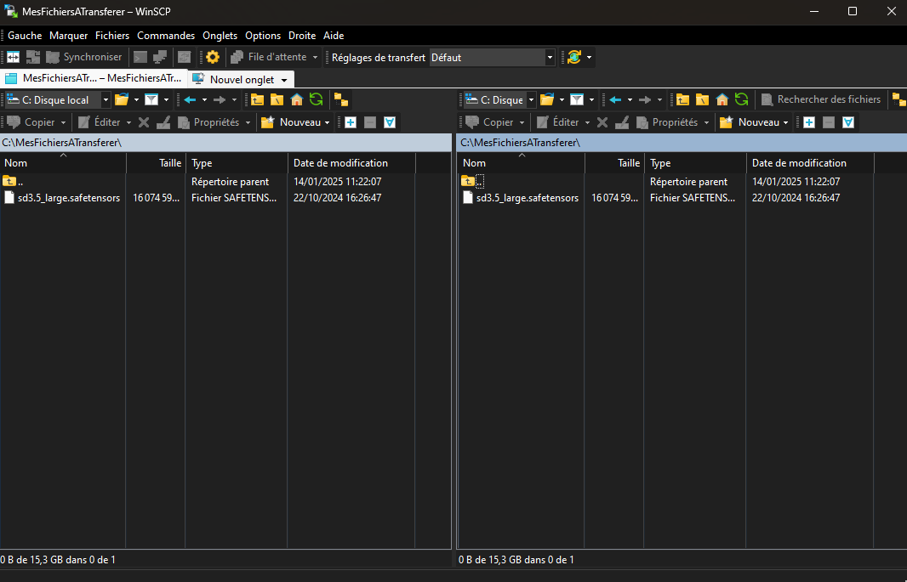

Cliquez sur 'Nouvel onglet'.
Dans la fenêtre qui s'ouvre renseigner vos informations de connexion et le serveur de login romeo 1, 2, 3 ou 4.

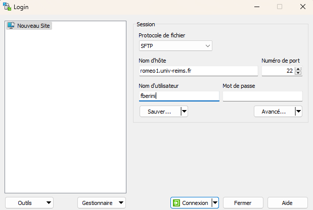

Vous allez avoir besoin d'une clé au format PPK, il faut donc convertir votre clé SSH.
Cliquez sur Outils en bas a gauche pour ouvrir PuTTY Key Generator.

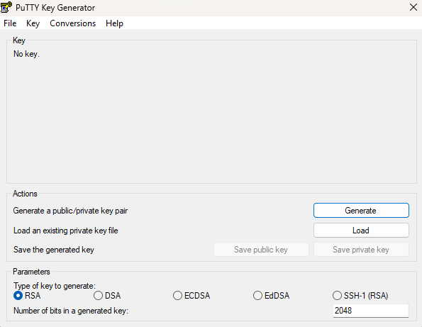

Cliquez sur Load, et ouvrez votre fichier de clé privé (il faudra peut être choisir "tous les fichiers" en bas à droite de la fenêtre pour le voir).
Si tout se passe bien vous allez voir votre clé dans l'interface.

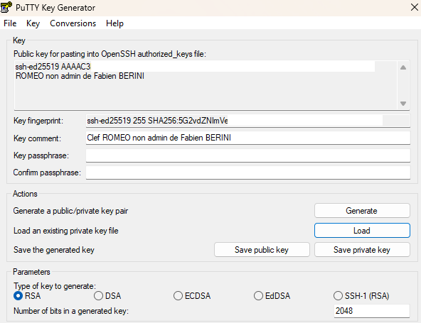

Cliquez sur 'Save Private Key' et enregistrez la clé, sans effacer l'originale.
Vous pouvez fermer PuTTY Key Generator

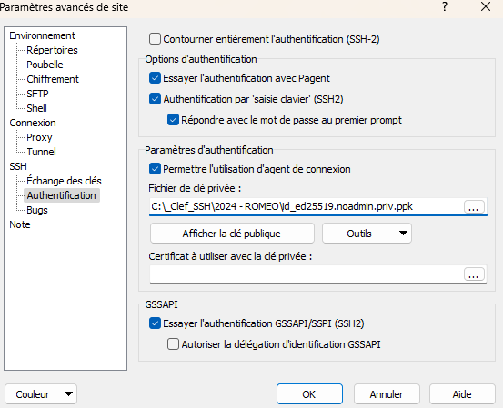

Dans l'interface précédente, cliquez sur ''Avancé", puis dans *SSH>Authentification*, dans la partie *Fichier de clé privée*, renseignez le fichier de clé PPK crée précédemment.
Faites OK, puis cliquez sur 'Sauver...'.

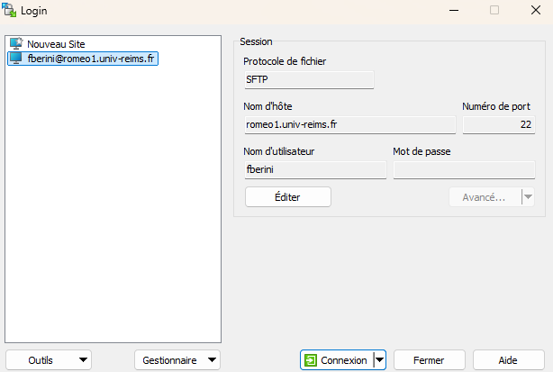

Vous pouvez maintenant, et a chaque lancement du logiciel, directement cliquer sur 'Nouvel Onglet', et simplement double cliquer sur le serveur enregistré à gauche pour ouvrir la connexion SFTP.

A gauche se trouve vos fichiers locaux, et à droite les fichiers distants sur ROMEO, vous pouvez téléverser des fichiers dans un sens ou dans l'autre depuis ces deux fenêtres.

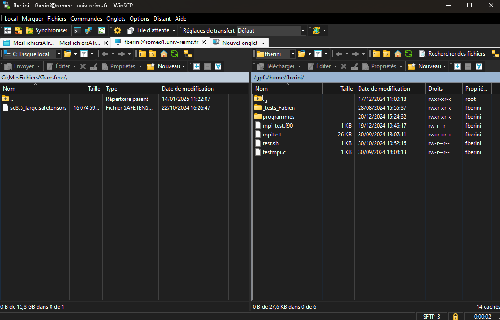

### Filezilla[​](#filezilla "Lien direct vers Filezilla")

Quand vous ouvrez Filezilla vous sera présenté deux panneaux, pour le moment celui de gauche permet de naviguer sur votre ordinateur.

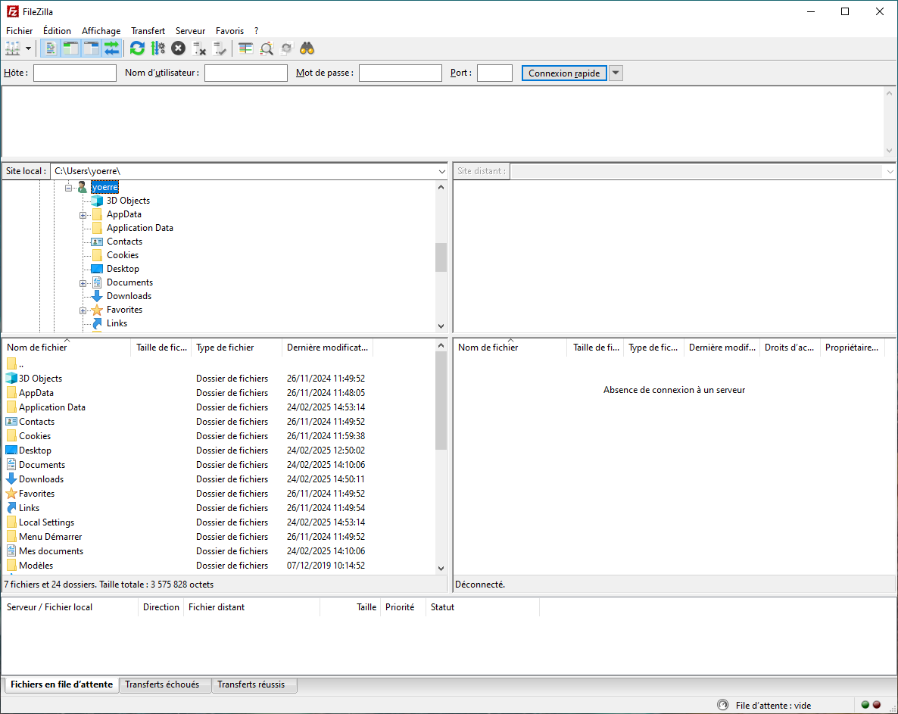

Cliquez sur « Ouvrir le gestionnaire de sites », l'incône située en haut à gauche sous « Fichier ».

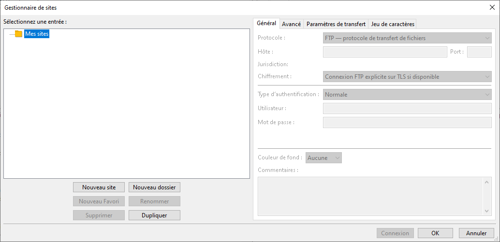

Cliquez sur « Nouveau site », puis commencez à remplir les informations du panneau « Général » en sélectionant le protocole SFTP et le type d'authentification « Fichier de clef ».

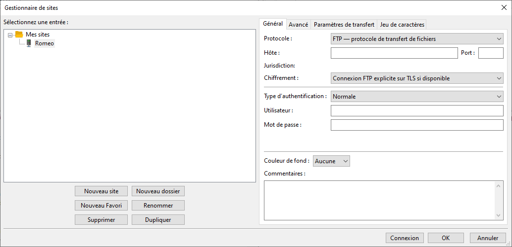

Cliquez sur « Parcourir » pour sélectionner votre fichier de clé sous le format PEM ou PPK. Si vous n'en avez pas, cliquez sur le menu déroulant en bas de l'écran (indiquant « Fichiers PPK » dans la plupart des cas) pour sélectionner « Tous les fichiers ». Vous pouvez sélectionner votre fichier de clé privée de connexion à Romeo, Filezilla vous proposera de la convertir en fichier de clé PPK compatible (Si votre clé a un mot de passe, Filezilla vous le demandera). Sauvegardez le fichier ainsi converti où vous souhaitez, par exemple dans le même dossier que les autres clés, puis cliquez sur « Valider » pour quitter la fenêtre de gestionnaire de sites.

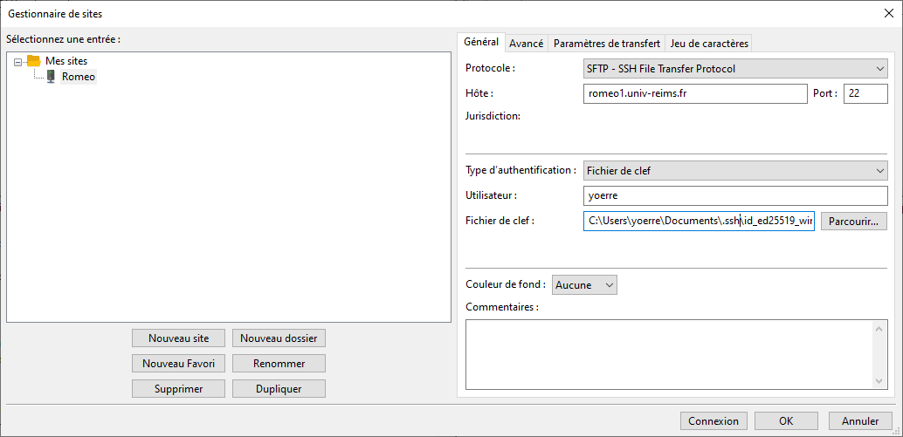

> ⚠️ **Attention**
>
> remarque

Si Filezilla ne vous propose pas la conversion de clé, vous pouvez utiliser la même méthode que pour WinSCP ci-dessus en utilisant PuTTY.

Il ne vous reste plus qu'à cliquer sur la petite flèche à côté de l'icône « Ouvrir le gestionnaire de sites » et de sélectionner le site précédemment créé. Lors de la première connexion, il est possible qu'une fenêtre s'affiche pour indiquer que la clé du serveur hôte est inconnue. Cette clé identifie le serveur auquel vous vous connectez, vous pouvez cocher « Toujours faire confiance à cet hôte, ajouter cette clef au cache » puis cliquer sur valider.

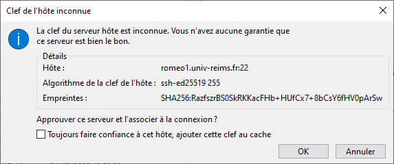

Votre dossier `/home/` devrait apparaître dans la colonne de droite. Vous pouvez téléverser des fichiers dans un sens ou dans l'autre depuis ces deux fenêtres.

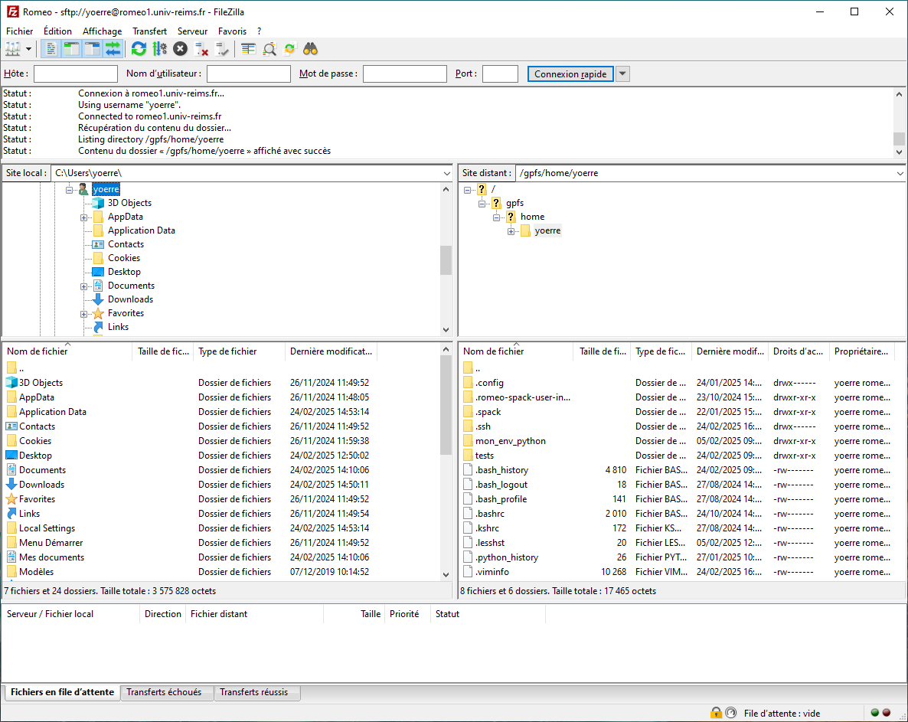

## Linux[​](#linux "Lien direct vers Linux")

Vous pouvez utiliser l'outil Filezilla, de la même manière qu'expliquée pour le système d'exploitation Windows.

Quand vous ouvrez Filezilla vous sera présenté deux panneaux, pour le moment celui de gauche permet de naviguer sur votre ordinateur.

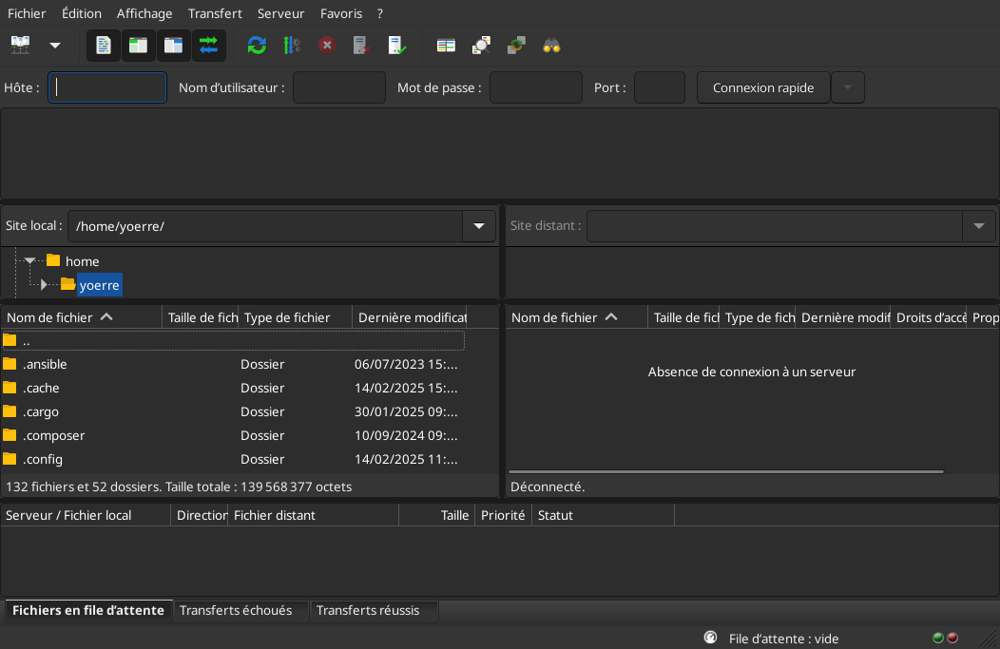

Cliquez sur « Ouvrir le gestionnaire de sites », l'incône située en haut à gauche sous « Fichier ».

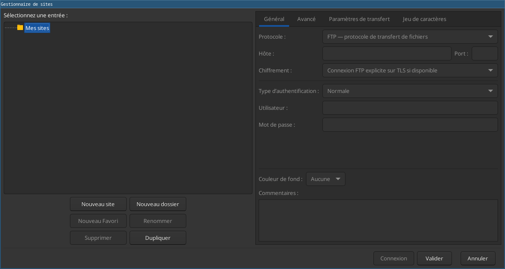

Cliquez sur « Nouveau site », puis commencez à remplir les informations du panneau « Général » en sélectionant le protocole SFTP et le type d'authentification « Fichier de clef ».

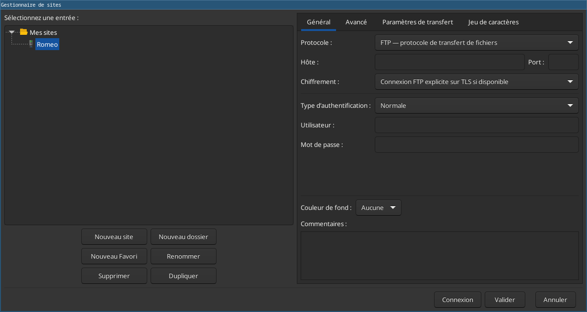

Cliquez sur « Parcourir » pour sélectionner votre fichier de clé sous le format PEM ou PPK. Si vous n'en avez pas, cliquez sur le menu déroulant en bas de l'écran (indiquant « Fichiers PPK » dans la plupart des cas) pour sélectionner « Tous les fichiers ». Vous pouvez sélectionner votre fichier de clé privée de connexion à Romeo, Filezilla vous proposera de la convertir en fichier de clé PPK compatible (Si votre clé a un mot de passe, Filezilla vous le demandera). Sauvegardez le fichier ainsi converti où vous souhaitez, par exemple dans le même dossier que les autres clés, puis cliquez sur « Valider » pour quitter la fenêtre de gestionnaire de sites.

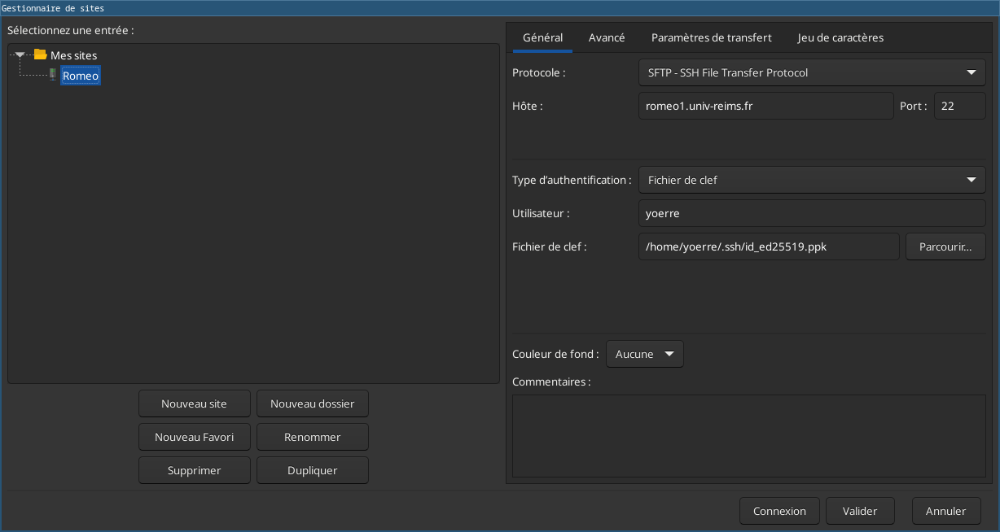

Il ne vous reste plus qu'à cliquer sur la petite flèche à côté de l'icône « Ouvrir le gestionnaire de sites » et de sélectionner le site précédemment créé. Lors de la première connexion, il est possible qu'une fenêtre s'affiche pour indiquer que la clé du serveur hôte est inconnue. Cette clé identifie le serveur auquel vous vous connectez, vous pouvez cocher « Toujours faire confiance à cet hôte, ajouter cette clef au cache » puis cliquer sur valider.

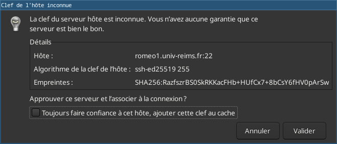

Votre dossier `/home/` devrait apparaître dans la colonne de droite. Vous pouvez téléverser des fichiers dans un sens ou dans l'autre depuis ces deux fenêtres.

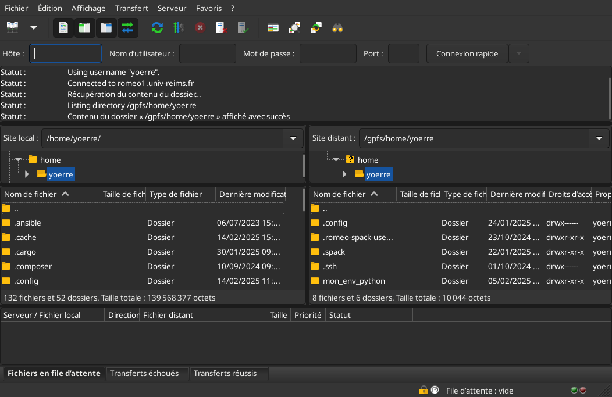

## Mac[​](#mac "Lien direct vers Mac")

A venir

---

← [Se connecter à ROMEO 2025](se_connecter.md) | → [Espaces de stockage](espaces_de_stockage.md)
