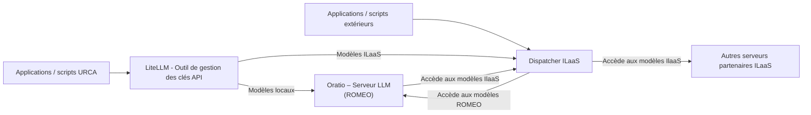

[Sommaire](../SOMMAIRE.md) › [Accueil](../index.md) › [Services](../services.md) › Oratio · [Corpus ROMEO](../README.md) · [Guides MCP](https://github.com/Gotman08/romeo-mcp/blob/main/docs/README.md) · [Tools](https://github.com/Gotman08/romeo-mcp/blob/main/docs/Tools.md)

# Oratio

**Oratio (GUI)** est l’interface web OpenWebUI installée sur l’infrastructure **ROMEO**.
Elle permet aux membres de l’URCA d’utiliser des modèles LLM **sans écrire de code**, directement depuis un navigateur.

> **⚠️ Accès GUI** : Oratio GUI est accessible **exclusivement aux utilisateurs possédant une adresse e-mail URCA valide**.

---

## L'interface web (oratio.univ-reims.fr)[​](#linterface-web-oratiouniv-reimsfr "Lien direct vers L'interface web (oratio.univ-reims.fr)")

C’est l’interface *visuelle* et utilisable par les utilisateurs URCA.
**Oratio GUI n’appartient pas au projet ILaaS**, mais peut utiliser les ressources du réseau ILaaS.

#### Pourquoi le nom “Oratio” ?[​](#pourquoi-le-nom-oratio- "Lien direct vers Pourquoi le nom “Oratio” ?")

Oratio est un mot latin signifiant « discours » ou « parole ».
Il évoque également **Horatio**, compagnon et témoin de Hamlet dans la pièce éponyme de Shakespeare, faisant écho à **ROMEO**.

## L'API[​](#lapi "Lien direct vers L'API")

L'API Oratio est une API de type 'OpenAI Compatible' servie par le programme LiteLLM.
Via cette API vous pouvez connecter vos applications aux modèles IA du Centre de calcul ROMEO et/ou du réseau IlaaS via une clé unique et personnelle valable 1 an.

# ILaaS – Réseau national

Le but du projet ILaaS est de fournir à l’Enseignement Supérieur Français des moyens techniques pour mettre en œuvre l’Intelligence Artificielle en répondant aux défis importants de soutenabilité, de résilience, de confiance et de sobriété numérique.
Il vise à offrir une infrastructure d’inférence mutualisée et fiable servant les besoins essentiels de l’ESR, en visant l’équilibre budgétaire, la qualité de service et la sécurité des données.

Le réseau repose sur un **dispatcher fédéré** redirigeant intelligemment les requêtes vers les différents serveurs d'inférence des participants au projet IlaaS.

Il est joignable par API uniquement. Plus d'informations sur <https://www.ilaas.fr/>

## Architecture Simplifiée[​](#architecture-simplifiée "Lien direct vers Architecture Simplifiée")

## Dans cette section

- [Interface Web Oratio](Oratio/gui_oratio.md)
- [API Oratio](Oratio/api_oratio.md)
- [Modèles disponibles](Oratio/models.md)

---

← [Accompagnement personnalisé pour les utilisateurs ROMEO](accompagnementScientifiqueCode.md) | → [Interface Web Oratio](Oratio/gui_oratio.md)

[↑ Haut de page](#oratio) · [Sommaire officiel](../SOMMAIRE.md) · [Guide du corpus](../README.md)
